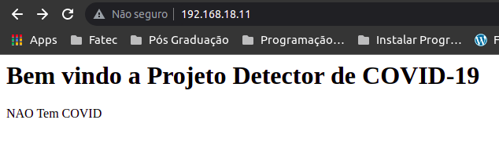
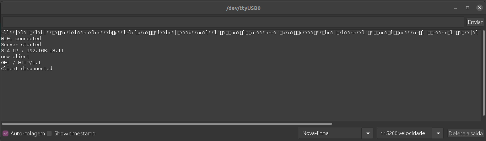
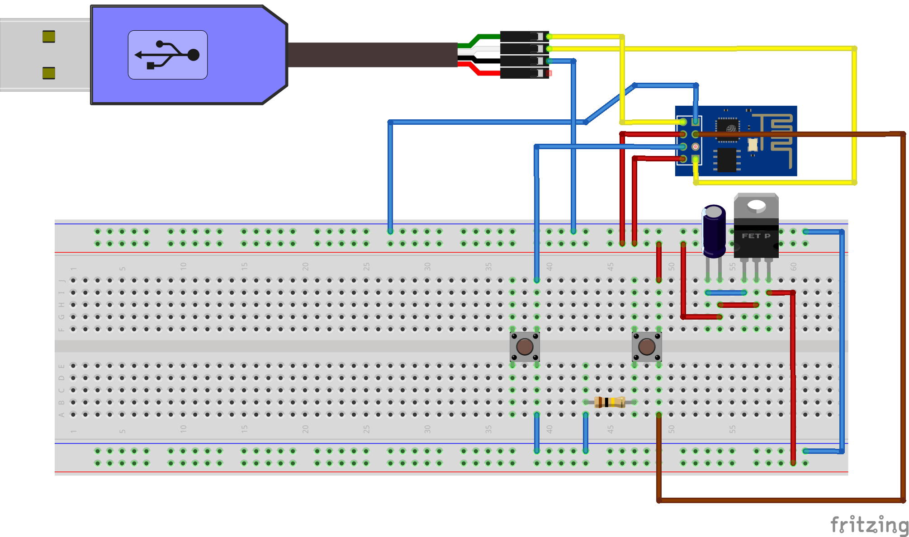
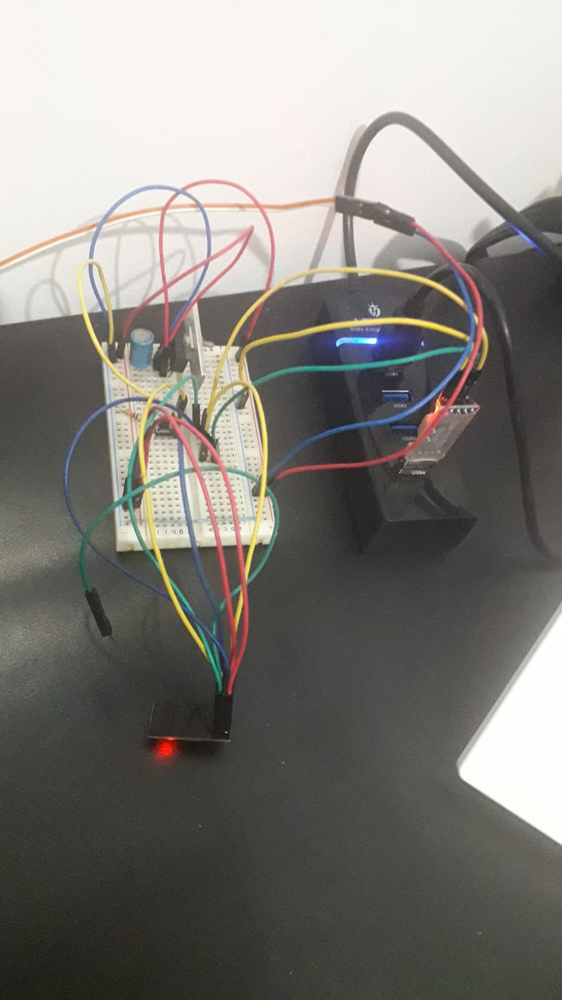

# Projeto UWa Detector de Covid-19

## esboco inicial
A implementacao conta com uma interface simples para informar ao usuario o status do ambiente com relacao a presenca do virus Covid-19. 
O prototipo inical foi desenvolvido com a utilizacao de um microcontrolador ESP8266, e microcontrolador que já possui tudo que é necessário para se conectar a Internet. Ou seja, ele e como um Arduino com integração Wi-Fi. Outro ponto importante é que ele e pequeno e isso viabiliza projetos pequenos. ... WiFi: IEEE 802.11 – b/g/n. O envio do sinal eletrico pelo biosensor foi simulado por um botao. Para comunicao foi utilizado o protocola HTTP, o microcontrolador recebe uma requisicao e envia um HTML contento as informacoes do status conform as figuras a seguir.

O programa envia para o terminal o status atual da comunicacao do usuario, informando a conexao o status de retorno (200, 404 etc.) e a desconexao para uma nova solicitacao.

A implementacao de hardware conforme o diagrama esquematico da protobord.

a implementacao em protobord fisica

